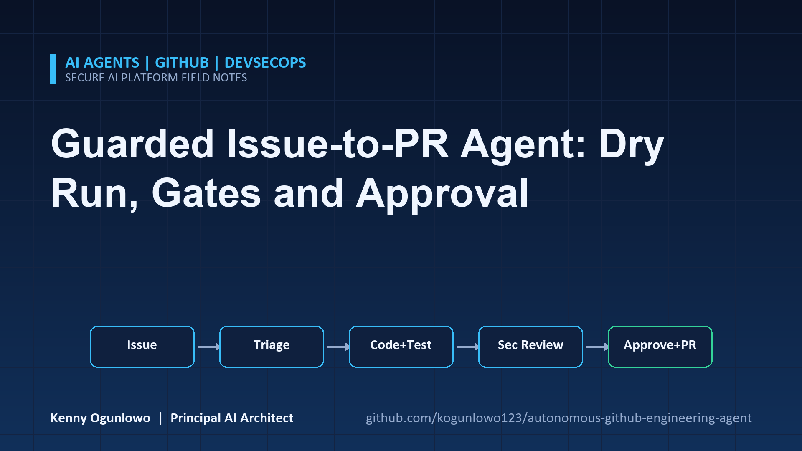
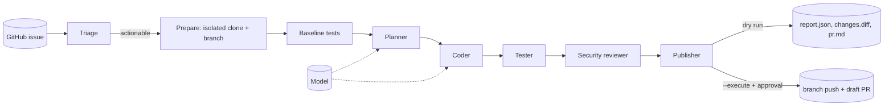
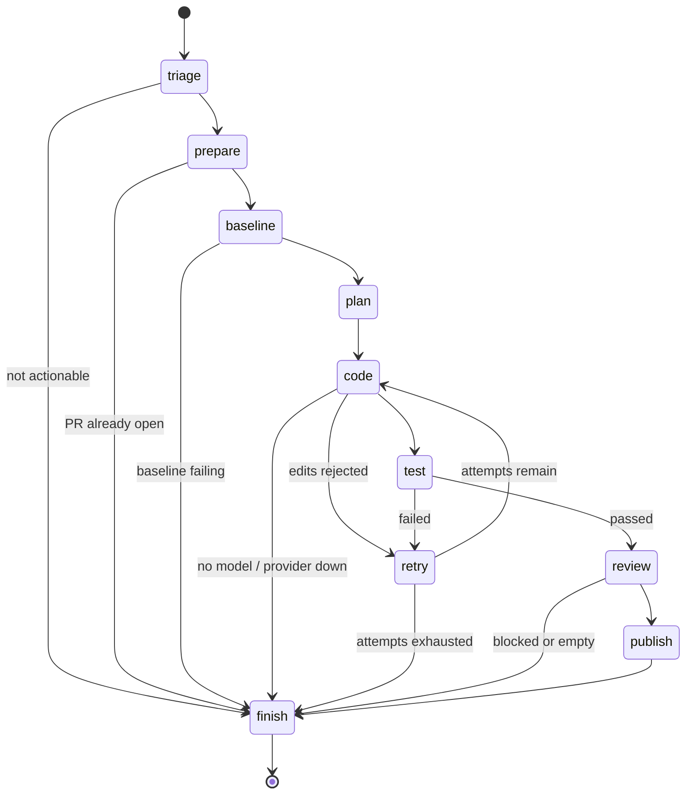

# Autonomous GitHub Engineering Agent



An issue-to-pull-request agent built around one idea: an autonomous system that reads text from
strangers and writes code should have hard limits that do not depend on the model behaving well.

Six agents (triage, planner, coder, tester, security reviewer, publisher) take a labelled GitHub
issue, work in an isolated clone, run the project's tests before and after the change, review the
diff for secrets and risky patterns, and prepare a pull request. **By default nothing leaves your
machine.** A run produces a report, a diff and a PR description on disk. Pushing a branch and opening a
draft pull request requires `--execute` plus explicit human approval. The agent never merges and never
pushes to a default branch.

## Table of contents

- [Project overview](#project-overview)
- [Architecture](#architecture)
- [Safety model](#safety-model)
- [Features](#features)
- [Repository structure](#repository-structure)
- [Installation](#installation)
- [Quick start](#quick-start)
- [Detailed usage](#detailed-usage)
- [Configuration](#configuration)
- [Security](#security)
- [Testing](#testing)
- [CI/CD](#cicd)
- [Limitations](#limitations)
- [Roadmap](#roadmap)
- [Contributing](#contributing)
- [License](#license)

## Project overview

### What it is

A Python library and CLI that turns a well-specified bug report or small feature request into a
reviewable pull request, and stops with an explanation when it should not proceed.

### Why it exists

Backlogs fill with small, clear issues that nobody has time for. Existing coding agents are impressive
but often run with broad permissions, treat issue text as instructions, and skip verification. This
project treats those as the primary risks and builds the workflow around controlling them: a maintainer
gate before anything starts, a green baseline before any change, tests after it, a security review of
the diff, and a human decision before anything is published.

### Who should use it

- Maintainers who want help with well-scoped issues without giving an agent the keys.
- Platform teams evaluating agentic engineering workflows with an auditable trail.
- Engineers who want a reference implementation of guarded agent automation.

### Business value

| Outcome | Mechanism |
| ------- | --------- |
| Small issues move without engineer time | The agent proposes a tested change; a person reviews it |
| Low blast radius | Isolated clone, capped diff size, protected paths, draft PRs, no merge |
| Trustworthy output | A change reaches review only if the baseline was green and tests pass after it |
| Auditability | Every run writes `report.json` with the decisions, evidence and per-step trace |
| Resistance to manipulation | Maintainer label gate, injection screening, untrusted-data prompt design |

## Architecture

### System architecture



### Agents

| Agent | Responsibility |
| ----- | -------------- |
| **Triage** | Applies the trigger policy (approval label, allowed authors), screens the issue text for prompt-injection patterns, classifies it (bug, feature, docs, chore, question, security) and refuses what should go to a human. |
| **Planner** | Chooses the files to read and outlines the change. A model proposes files from the repository listing; a keyword search over paths and contents is the deterministic fallback. |
| **Coder** | Asks the model for a JSON change set of exact search-and-replace or create edits, then applies it all-or-nothing under path policy. |
| **Tester** | Runs the project's test command with a scrubbed environment and a timeout, once before any change and once after. |
| **Security reviewer** | Scans the diff for secrets, remote-code execution patterns, dangerous calls, weakened tests and dependency changes, and enforces file-count and line-count limits. |
| **Publisher** | Writes the PR text, commits locally, and only after approval pushes the branch and opens a draft PR. |

### Execution flow



Every path ends in `finish`, which writes the audit artifacts. Failed edits and failing tests are fed
back to the model (test output is redacted and truncated) for up to `max_attempts` tries, and the
working copy is reset between attempts.

Design details and decisions are in [docs/architecture.md](docs/architecture.md) and [docs/adr](docs/adr).

## Safety model

The design assumes the issue author is untrusted and the model can be manipulated.

| Risk | Control |
| ---- | ------- |
| A stranger files an issue that steers the agent | Work starts only when a maintainer has applied an approval label (default `ghagent:approved`, since only maintainers can label); optional author allowlist |
| Prompt injection in issue text | Injection heuristics stop the run before any model call; the model is told issue text is data, and closing delimiter tags inside it are neutralised |
| The model edits things it should not | Protected paths (`.git/`, `.github/`, env and key files), path traversal and symlink checks, a file-count cap, and all-or-nothing application |
| The model "fixes" a bug by weakening tests | The reviewer flags removed assertions and disabled tests; the prompt forbids it; a green baseline is required first |
| Secrets or dangerous code in the diff | Credentials and pipe-to-shell block publication; `eval`, `shell=True`, `pickle`, disabled TLS and similar are surfaced as warnings in the PR |
| Oversized or unreviewable changes | Blocked above `max_files` and `max_diff_lines` |
| The agent acts without a person | Live mode requires `--execute` and an approval step (interactive prompt or explicit `--yes`) |
| The agent touches production branches | Publishes only from `ghagent/...` branches, never force-pushes, never merges, opens PRs as drafts by default |
| Duplicate or conflicting work | An open PR from the agent's branch for the same issue stops the run |
| Credential exposure | The token travels in `GIT_CONFIG_*` environment variables, never argv, remote URLs or `.git/config`; it is stripped from the test environment and redacted from logs and errors |
| PR text that pings people or injects markup | Mentions are broken and HTML removed from any model- or issue-derived text |

## Features

- Guarded issue-to-PR pipeline with a retry loop driven by test feedback.
- Dry run by default, with artifacts for review: `report.json`, `changes.diff`, `pr.md`.
- Real git operations in an isolated clone; the source repository is never modified.
- Green-baseline requirement so failures are attributed correctly.
- Diff security review with blocking and warning rules.
- Human approval gate before push, with interactive and non-interactive modes.
- OpenAI or Anthropic models for planning and coding; heuristic planning without one.
- `ghagent policy` prints the active limits; `ghagent triage` classifies an issue without touching a repository.
- Structured JSON logging with secret redaction, bounded retries, typed configuration.

## Repository structure

```
autonomous-github-engineering-agent/
├── .github/
│   ├── dependabot.yml
│   └── workflows/
│       ├── ci.yml                    # lint, format, types, tests, audit, build
│       └── codeql.yml
├── docs/
│   ├── architecture.md
│   └── adr/                          # architecture decision records
├── src/ghagent/
│   ├── agents/
│   │   ├── triage.py                 # trigger policy, injection screening, classification
│   │   ├── planner.py                # file selection and plan
│   │   ├── coder.py                  # model edits, applied under policy
│   │   ├── tester.py                 # baseline and post-change test runs
│   │   ├── reviewer.py               # diff security review and limits
│   │   ├── publisher.py              # PR text, commit, approval, push, PR
│   │   └── state.py                  # run state and approvers
│   ├── providers/                    # HTTP client and chat clients
│   ├── artifacts.py                  # report, diff and PR text on disk
│   ├── cli.py                        # ghagent run | triage | policy
│   ├── config.py
│   ├── container.py                  # composition root
│   ├── github.py                     # issues and pull requests (read issue, open PR only)
│   ├── gitops.py                     # safe git wrapper
│   ├── graph.py                      # workflow engine
│   ├── models.py
│   ├── pipeline.py                   # graph wiring and retry logic
│   ├── runner.py                     # test execution with scrubbed environment
│   ├── security.py                   # path policy, diff scanner, redaction
│   ├── service.py
│   └── workspace.py                  # all-or-nothing edit application
├── tests/
│   ├── unit/
│   ├── integration/                  # real git repositories, scripted model, mock GitHub
│   └── conftest.py
├── .env.example
├── CHANGELOG.md
├── CONTRIBUTING.md
├── Dockerfile
├── LICENSE
├── Makefile
├── SECURITY.md
├── pyproject.toml
├── requirements.txt
└── requirements-dev.txt
```

## Installation

Requirements: Python 3.10 or newer and `git` on the `PATH`.

```bash
git clone <repository-url>
cd autonomous-github-engineering-agent
python -m venv .venv
source .venv/bin/activate            # Windows: .venv\Scripts\activate
python -m pip install -e ".[dev]"
```

## Quick start

Start by inspecting the limits that apply and how an issue would be triaged. Neither step touches a
repository or the network.

```bash
ghagent policy
```

```
mode: dry run
draft pull requests: True
required issue label: ghagent:approved
allowed authors: (anyone)
protected paths: ['.git/', '.github/', '.env', 'id_rsa', 'id_ed25519', '*.pem', '*.key', '*.p12', '*.pfx', '*.jks']
max files: 5
max changed lines: 400
max attempts: 2
branch prefix: ghagent/
test command: ['python', '-m', 'pytest', '-q']
require green baseline: True
merges: never
pushes to default branch: never
```

Save an issue as JSON (or fetch it from GitHub with `owner/repo#123`):

```json
{"repo": "acme/demo", "number": 7, "title": "average() returns the wrong value",
 "body": "Calling average([2, 4, 6]) in pkg/calc.py returns 3.0 instead of 4.0.",
 "labels": ["ghagent:approved"], "author": "maintainer"}
```

```bash
ghagent triage --issue-file issue.json
```

```
Category: bug  Priority: p2
Actionable: yes
```

Without the `ghagent:approved` label the same issue is refused:

```
Category: bug  Priority: p2
Actionable: no
- issue is missing the approval label 'ghagent:approved'
```

Now run it against a local checkout. The coder needs a model:

```bash
export GHAGENT_LLM_PROVIDER=anthropic         # or: openai
export GHAGENT_ANTHROPIC_API_KEY=...
ghagent run --issue-file issue.json --source /path/to/repo
```

```
Issue: acme/demo#7
Status: pr_ready (dry run)
- dry run: committed locally only, nothing was pushed
Branch: ghagent/issue-7
diff: .ghagent/runs/acme-demo-7/changes.diff
pull_request: .ghagent/runs/acme-demo-7/pr.md
workdir: .ghagent/work/acme-demo-7
report: .ghagent/runs/acme-demo-7/report.json
```

Review `changes.diff` and `pr.md`. The `workdir` is a normal git clone on branch `ghagent/issue-7`, so you
can also inspect it with your usual tools. The output above shows the format of a successful run. It
was not produced by a live model in this repository's test suite, which drives the pipeline with a
scripted model (see [Limitations](#limitations)).

Without a model configured the run still triages, clones, runs the baseline and produces a heuristic
plan, then stops with `needs_human: no model is configured for the coder`.

## Detailed usage

### 1. Dry run against GitHub

```bash
export GITHUB_TOKEN=...                      # read access to issues is enough for a dry run
ghagent run acme/demo#7
```

The issue is fetched, the repository is cloned from `https://github.com/acme/demo.git` into
`GHAGENT_WORK_DIR` and processed. Nothing is pushed.

### 2. Going live

```bash
ghagent run acme/demo#7 --execute
```

After the change passes tests and review, you are asked to approve:

```
About to push and open a pull request:
  fix: Fix average() to divide by the number of values (#7): 2 files, +8/-1, branch ghagent/issue-7 -> main
Proceed? [y/N]
```

On yes, the branch is pushed (no force) and a **draft** pull request is opened. Use `--yes` to approve
non-interactively in trusted automation. Without a terminal and without `--yes`, approval is declined.

For repositories you cannot push to, push to a fork:

```bash
export GHAGENT_PUSH_URL=https://github.com/you/demo.git
export GHAGENT_PR_HEAD_OWNER=you
```

### 3. Statuses and exit codes

| Status | Meaning | Exit |
| ------ | ------- | ---- |
| `pr_ready` | Dry run complete; PR text and diff are on disk | 0 |
| `pr_opened` | Draft PR opened | 0 |
| `needs_human` | Not actionable, injection suspected, PR already open, or no model | 1 |
| `baseline_failing` | Tests fail before any change | 1 |
| `edit_failed` | The model's edits could not be applied within the attempt budget | 1 |
| `tests_failed` | Tests still fail after the attempt budget | 1 |
| `no_change` | The edits produced no difference | 1 |
| `blocked_security` | The diff review found a blocking issue or limit | 1 |
| `awaiting_approval` | A human declined the push; the branch exists only locally | 1 |

Usage and runtime errors exit 2.

### 4. Python API

```python
from ghagent import Issue, Settings, build_service

service = build_service(Settings())
issue = Issue(
    repo="acme/demo",
    number=7,
    title="average() returns the wrong value",
    body="Calling average([2, 4, 6]) returns 3.0 instead of 4.0.",
    labels=["ghagent:approved"],
    author="maintainer",
)
report = service.run(issue, source="/path/to/repo")
print(report.status, report.reasons, report.artifacts)
```

### 5. Custom approval

Pass any object with an `approve(summary) -> bool` method as `approver` to `build_service`, for example
one that posts to a chat channel and waits.

### 6. Reading the report

`report.json` contains the triage verdict, plan, change set, baseline and final test results, security
findings, diff statistics, the per-step trace with timings, and the paths of the other artifacts.

## Configuration

Read from `GHAGENT_*` environment variables and an optional `.env` file. See [.env.example](.env.example).

| Variable | Default | Purpose |
| -------- | ------- | ------- |
| `GHAGENT_DRY_RUN` | `true` | Set `false` (or use `--execute`) for live mode |
| `GHAGENT_DRAFT_PR` | `true` | Open pull requests as drafts |
| `GHAGENT_GITHUB_TOKEN` | unset | Also accepts `GITHUB_TOKEN` |
| `GHAGENT_REQUIRED_LABEL` | `ghagent:approved` | Issue must carry this label; empty disables the gate |
| `GHAGENT_ALLOWED_AUTHORS` | `[]` | JSON list; empty allows any author |
| `GHAGENT_LLM_PROVIDER` | `none` | `none`, `openai` or `anthropic` |
| `GHAGENT_OPENAI_API_KEY` / `GHAGENT_ANTHROPIC_API_KEY` | unset | Also accept the vendor-standard names |
| `GHAGENT_OPENAI_CHAT_MODEL` / `GHAGENT_ANTHROPIC_MODEL` | `gpt-4o` / `claude-sonnet-5` | Model names |
| `GHAGENT_MAX_FILES` | `5` | Files a change may touch |
| `GHAGENT_MAX_DIFF_LINES` | `400` | Added plus removed lines allowed |
| `GHAGENT_MAX_ATTEMPTS` | `2` | Coder attempts including retries |
| `GHAGENT_DENY_PATHS` | see `ghagent policy` | JSON list of protected paths |
| `GHAGENT_BRANCH_PREFIX` | `ghagent/` | Prefix for agent branches; must end with `/` |
| `GHAGENT_TEST_COMMAND` | `["python","-m","pytest","-q"]` | JSON list run in the clone |
| `GHAGENT_TEST_TIMEOUT_SECONDS` | `600` | Per test run |
| `GHAGENT_REQUIRE_GREEN_BASELINE` | `true` | Stop if tests fail before any change |
| `GHAGENT_CLONE_URL_TEMPLATE` | `https://github.com/{repo}.git` | Where to clone from |
| `GHAGENT_PUSH_URL` / `GHAGENT_PR_HEAD_OWNER` | unset | Push to a fork and open the PR from it |
| `GHAGENT_WORK_DIR` / `GHAGENT_OUT_DIR` | `.ghagent/work` / `.ghagent/runs` | Clones and artifacts |
| `GHAGENT_PR_FOOTER` | see `.env.example` | Line appended to every PR body |
| `GHAGENT_LOG_LEVEL` / `GHAGENT_LOG_JSON` | `WARNING` / `true` | Logging |

## Security

See [SECURITY.md](SECURITY.md) for the full threat table, the trust boundary, deployment guidance and how
to report a vulnerability. The most important point: **the test runner is not a sandbox.** Tests execute
with your privileges. Run the agent in a disposable container or CI runner for any repository you do
not fully trust.

## Testing

```bash
python -m pytest                                  # everything, coverage gate at 80%
python -m pytest tests/unit                       # unit tests
python -m pytest -m integration                   # end-to-end runs
```

The suite is offline and deterministic, but not mocked at the git layer. Integration tests create real
repositories in temporary directories, clone them, run real nested test suites, and push to a real bare
repository. The model is a scripted double and GitHub is an in-process mock. They cover: the happy
path; a source repository left untouched; approval-label and injection refusals; a failing baseline;
recovery after failing tests; giving up; rejected edits; protected and escaping paths; secrets in the
diff; oversized changes; warnings in the PR; markup and mention neutralisation; live mode with
approval, declined approval, an existing PR, fork heads and a missing token; and the CLI including
exit codes.

Static checks: `make lint` (ruff) and `make typecheck` (`mypy --strict`).

## CI/CD

`.github/workflows/ci.yml` runs on every push to `main` and every pull request:

| Job | What it does |
| --- | ------------ |
| Lint, format and types | `ruff check`, `ruff format --check`, `mypy --strict` |
| Tests | Python 3.10 to 3.13 matrix with an 80% coverage gate |
| Dependency audit | `pip-audit` against `requirements.txt` |
| Build validation | Builds sdist and wheel, `twine check`, builds and smoke-tests the Docker image |

`.github/workflows/codeql.yml` runs CodeQL on pushes, pull requests and weekly. Dependabot proposes
weekly updates.

## Limitations

- **Not validated against live models.** Prompts, JSON handling and retries are tested with a scripted
  model. Real-model behaviour, including how often edits apply cleanly, has not been measured.
- **Not a sandbox.** Test execution has scrubbed environment variables and a timeout, nothing more.
- **Only the issue body is used.** Comments are not read, to avoid a second untrusted channel.
- **Small, well-specified changes.** Whole-file context is limited (`GHAGENT_MAX_CONTEXT_CHARS`), edits are exact
  search-and-replace, and there is no repository-wide reasoning.
- **Heuristic checks.** Injection screening, secret detection and dangerous-pattern rules are pattern
  based and can miss things. They reduce risk; the human review remains the control that matters.
- **Python-first defaults.** The default test command is pytest. Other stacks work by setting
  `GHAGENT_TEST_COMMAND`, but the diff rules and examples lean towards Python.
- **Live GitHub paths are tested against a mock.** Cloning over HTTPS with a token and opening a PR on
  github.com have not been exercised in this repository's tests.

## Roadmap

| Milestone | Scope |
| --------- | ----- |
| Next | Container-based test execution (no ambient credentials, no network) |
| Next | Evaluation harness with a labelled issue set to measure success rate and false-positive risk |
| Later | Issue comment intake restricted to trusted collaborators |
| Later | Review feedback loop: revise the PR from reviewer comments |
| Later | Extra static analysis in the reviewer (Semgrep, dependency advisory checks) |
| Later | GitHub App authentication with per-repository, least-privilege tokens |

## Contributing

Read [CONTRIBUTING.md](CONTRIBUTING.md). Report vulnerabilities privately as described in
[SECURITY.md](SECURITY.md).

## License

Released under the [MIT License](LICENSE).
