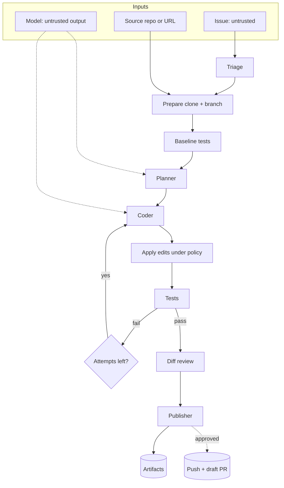

# Architecture

## Problem statement

Coding agents that turn issues into pull requests are attractive for small backlog items, but they
combine three hazards: they act on text from anyone who can file an issue, they execute code they have
just written, and they can publish to shared systems. This project defines an issue-to-PR workflow in
which each hazard has an explicit, testable control that does not rely on the model behaving well.

## Requirements

| # | Requirement | Where it is met |
| - | ----------- | --------------- |
| R1 | Only act on issues a maintainer has approved | Triage: approval label, author allowlist |
| R2 | Resist instructions hidden in issues and files | Injection screening; data-only prompt design; delimiter neutralisation |
| R3 | Never modify the source repository or shared branches | Isolated clone; `ghagent/` branches; no force push; no merge code |
| R4 | Publish only with a human decision | Dry run by default; `--execute` plus approval |
| R5 | A change must be verified | Green baseline, tests after the change, retry with feedback |
| R6 | Dangerous diffs must not ship | Diff scanner with blocking rules and size limits |
| R7 | Every run is auditable | `report.json` with decisions, evidence and step trace |
| R8 | Testable without network or model access | Injected model and GitHub client; real local git repositories |

## System overview

## Workflow engine

The pipeline is a small state machine (`graph.py`) with conditional edges and a step budget. Nodes
are agent methods; a wrapper appends a trace event (node, detail, duration) after each. Any node ends
the run by setting a terminal status (`state.halt`); routers send halted runs to `finish`, which writes
the artifacts. Because every terminal path passes through `finish`, a report exists for every outcome,
including refusals.

## Trust and data flow

- **Issue** text reaches only the triage patterns, the planner prompt and the coder prompt, always in
  delimited sections with closing tags neutralised. Injection-shaped text stops the run before any
  model call.
- **Repository files** are read only after the path policy and size checks, and enter prompts inside
  `<file>` tags. Test output returned to the model is redacted and truncated.
- **Model output** is parsed as JSON and validated with pydantic, then applied by `apply_edits`, which
  enforces path policy, file counts, sizes, exact-once matching and NUL-free text, and writes nothing
  unless every edit is valid.
- **The diff** is produced by git after the edits and scanned as text, independent of what the model
  claimed to have changed.

## Edits

The coder returns exact `search`/`replace` edits or whole-file `create` edits, not unified diffs. Exact
matching removes the most common failure of model-generated diffs (misaligned hunks), makes rejections
specific enough to feed back ("found 0 matches"), and keeps application deterministic. The trade-off is
that large or overlapping refactors are awkward, which is acceptable given the size limits.

## Test execution

`run_tests` executes the configured command as an argument list with a minimal environment (an
allowlist of variables plus `CI=1`), a timeout and redacted, tail-truncated output. The baseline run uses
the same path. If the baseline fails the run stops, because otherwise pre-existing failures would be
blamed on the model and a "fix" could hide them.

## Retry loop

After a rejected edit or failing tests, `retry` increments the attempt counter, resets the working copy
(`reset --hard` and `clean -fd`), clears the previous change set and sets feedback: the edit error, or
the test output tail with an instruction not to weaken tests. When attempts are exhausted the run ends
as `edit_failed` or `tests_failed`. The failed working copy is left in place for inspection.

## Publication

The publisher builds the PR from validated data only, neutralising model-derived text. It commits on the
agent branch, then in live mode asks the approver. Only after approval does it push
(`branch:refs/heads/branch`, no force) and open a PR, draft by default. It refuses to run if the branch
lacks the configured prefix or equals the base branch.

## Trade-offs

| Decision | Benefit | Cost |
| -------- | ------- | ---- |
| Label gate | Strong, cheap authorisation that GitHub already enforces | Maintainers must label; no fully automatic triage |
| Green baseline required | Correct attribution of failures | Repos with flaky or failing suites cannot use it until fixed (configurable) |
| Exact-match edits | Deterministic, precise feedback | Fewer large refactors succeed |
| Issue body only | One untrusted channel instead of many | Discussion that clarifies an issue is ignored |
| In-repo workflow engine | No framework dependency | No checkpointing or streaming |
| Process hygiene instead of a sandbox | Works anywhere, simple | Repository tests still run with the agent's privileges |

## Scalability

Runs are independent: each has its own clone and artifact directory keyed by repository and issue
number, so they can be distributed across workers. The dominant costs are model calls (planner plus up
to `max_attempts` coder calls) and test runs (one baseline plus up to `max_attempts`).

## Extensibility

- **Model providers:** implement `LLMClient`.
- **Approval:** implement `Approver` (chat approval, ticket system).
- **Review rules:** extend `security.scan_diff` or add a reviewer agent to the pipeline.
- **Stacks:** set `GHAGENT_TEST_COMMAND`; add build-file patterns to the scanner.
